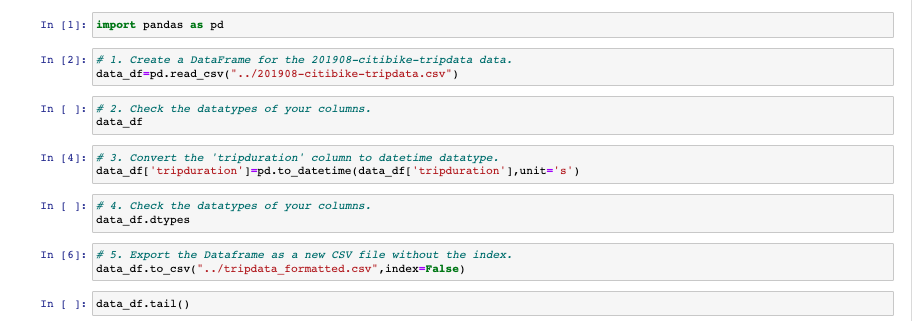
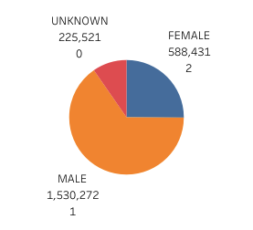
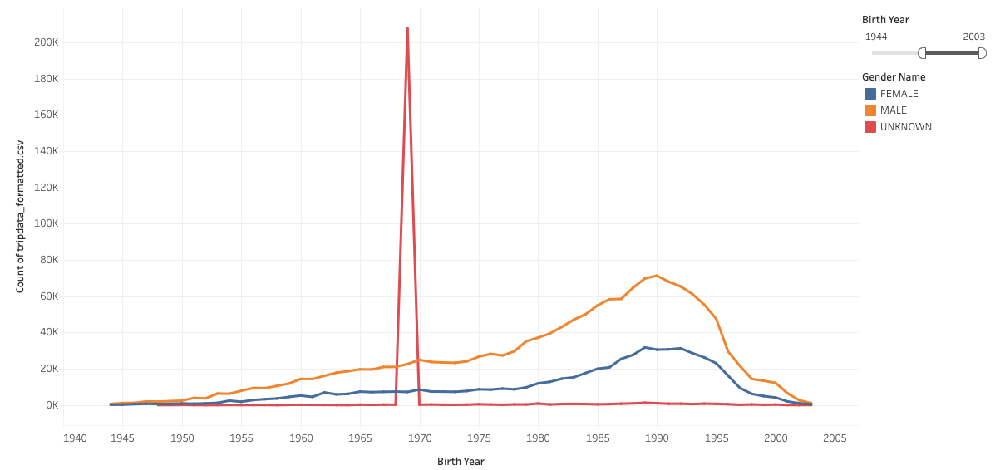
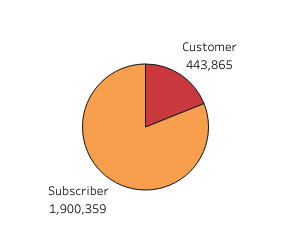
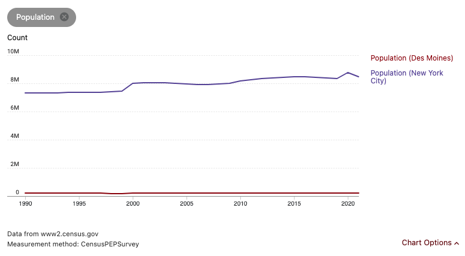
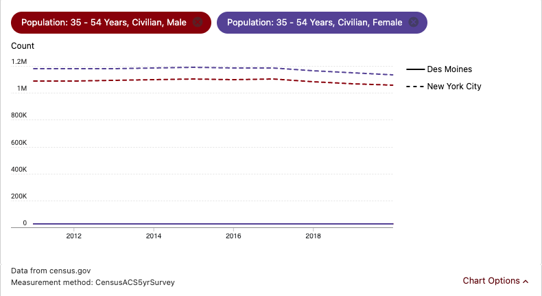

# Bikesharing

## Overview
Analysing the New York bike ride data and creating visualizations,dashboards and stories to present to ket seed investor to start bikeride bussiness in hometown.
The finished analysis results can be viewed on Tableu.

[NYCiti Bike Analysis](https://public.tableau.com/app/profile/vikas0809/viz/NYCityBike-1/Story1)

## Tools Used:

- Tableau Public
- Python(Jupyter notebook and Pandas libarary)
- NyCitiBike Aug 2019 Data [CitiBike System Data](https://ride.citibikenyc.com/system-data)

## Detailed Analysis

### Data cleaning.

We noticed the trip duration for each transaction is not what it is supposed to be(int64).The datatype of the coloumn needed to be changed to datetime otherwise it can cause our visualization to display incorrect information.Before we start making charts and all,our data needed a bit of cleaning and correction.We used pandas libarary to excute the plan.

- We imported the csv into dataframe.
- Then,we changed the datatype to datetime.
- Export the dataframe into new formatted csv file.

### Data Visualization.

We used public version of Tableau to create our visualizations.

#### Gender Breakdown

- The total number of Citi Bike bike sharing users are 2,344,334
- 65.2% MALE
- 25.1% FEMALE
- 9.6% UNKNOWN

#### Age. Breakdown.

Most number of customers are born between 1975-1995.And most frequent users are born in 1990 and are male.

There is a anomality that we see in this graph.We noticed a spike in trip count for age between 1967 and 1970 and their gender is unknown.We can assume that users of that age group did not enter their gender correctly or skipped while signing up for the app.

#### User Type

- 443,865 customers for month of August.
- 1,900,359 subscriber for same month.

### Summary

We do not think that Des Moino is a viable option for a bussiness model like CitiBike.This is based on varuious factors like
- Current Polulation
- Number of users.
- Tourist spots and bussiness centres.
- Declining polulation in Des Moino.

CitiBike has most customer of age group of 35-54.New York has over 1.16 million of males and 1.08 million females under this age group while Des Moino is 27 thousand for same category.

 
